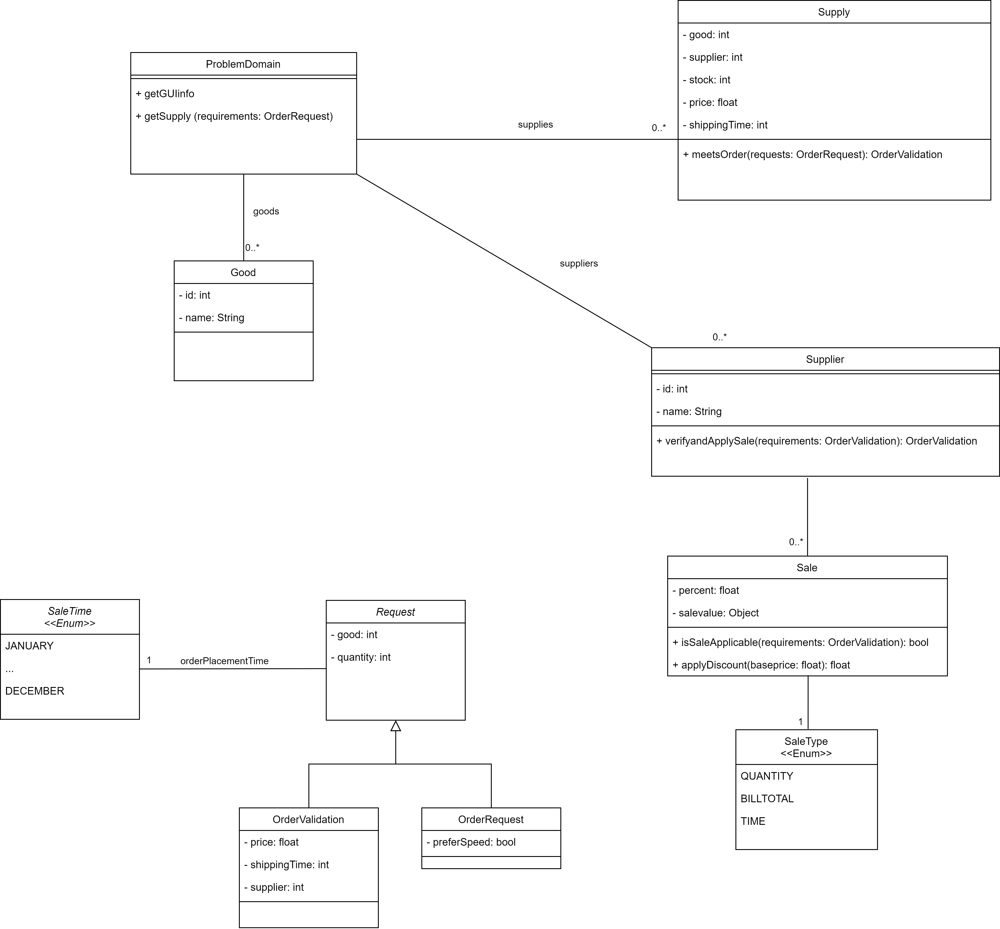

L'architettura del sistema è composta da 3 parti, ciascuna sul proprio livello logico:

- un sito web che funge da interfaccia

- un programma Java che esegue la logica applicativa

- un database che contiene le informazioni

La comunicazione tra le varie parti del sistema avviene dal livello più alto al livello più basso e viceversa, similarmente a uno stack di telecomunicazioni. 

Di seguito il modello ER usato per la progettazione del database.

Di seguito il diagramma UML delle classi usato per la progettazione della logica applicativa. Non sono mostrati classi e metodi dipendenti dall'implementazione, come getter, setter, costruttori, e funzioni di libreria.

La struttura delle classi riprende quella del database e aggiunge le funzionalità di competenza.

Leggere il manuale per ulteriori informazioni.
